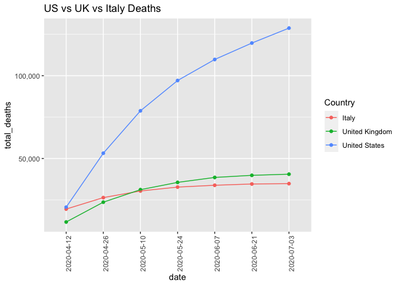
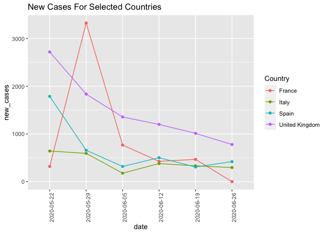
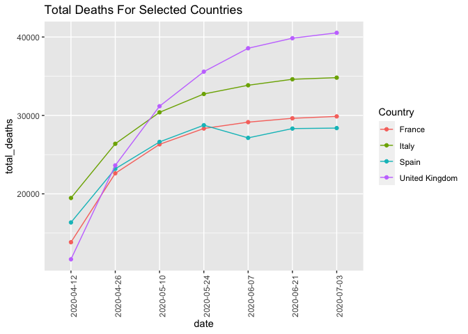
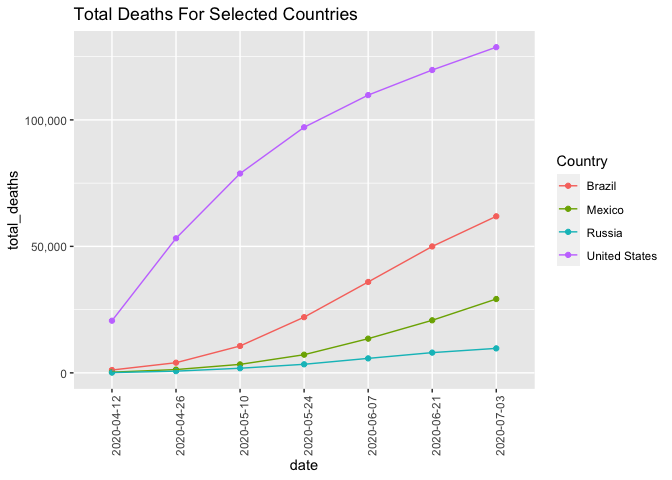
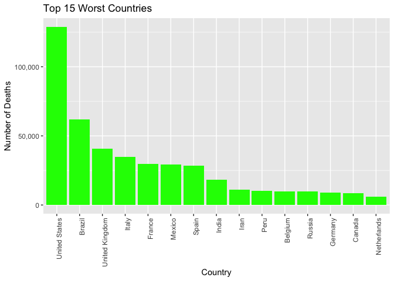

## Introduction

In this project, we will use the publicly available Covid-19 data to examine cases and deaths from a given country and also compare cases and deaths for multiple countries. We will use the *dplyr* and *sqldf* packages to filter the data and *ggplot2* to plot the results.

## Data Processing

First we want to load the packages that are required and then read in the source csv file that we will use as part of the analysis.


```r
# Load required packages

library(dplyr)
```

```
## 
## Attaching package: 'dplyr'
```

```
## The following objects are masked from 'package:stats':
## 
##     filter, lag
```

```
## The following objects are masked from 'package:base':
## 
##     intersect, setdiff, setequal, union
```

```r
library(ggplot2)
library(sqldf)
```

```
## Loading required package: gsubfn
```

```
## Loading required package: proto
```

```
## Warning in system2("/usr/bin/otool", c("-L", shQuote(DSO)), stdout = TRUE):
## running command ''/usr/bin/otool' -L '/Library/Frameworks/R.framework/Resources/
## library/tcltk/libs//tcltk.so'' had status 1
```

```
## Loading required package: RSQLite
```

```r
library(scales)

# Read in source csv file

covid <- read.csv("https://github.com/owid/covid-19-data/raw/master/public/data/owid-covid-data.csv", header = TRUE, sep = ",", stringsAsFactors = FALSE)
```

Let's first look at a single country just to get a feel for the data. We will look at the new deaths in the UK for a two week period in June.


```r
# Filter United Kingdom and specify the date range required

countryDeaths <- filter(covid, location == "United Kingdom", date >= "2020-06-16" & date <= "2020-06-30")

#Use ggplot2 to visualise the data

ggplot(countryDeaths, aes(date, new_deaths, group=1)) + geom_point(color="red") + geom_line(color="red") + 
        theme(axis.text.x = element_text(angle = 90, hjust = 1)) +
        ggtitle("Deaths over last 14 days") 
```

<!-- -->

Now let's look at the new cases for the UK for the same period.


```r
# Filter United Kingdom and specify the date range required

countryCases <- filter(covid, location == "United Kingdom", date >= "2020-06-16" & date <= "2020-06-30")

#Use ggplot2 to visualise the data

ggplot(countryCases, aes(date, new_cases, group=1)) + geom_point(color="red") + geom_line(color="red") + 
        theme(axis.text.x = element_text(angle = 90, hjust = 1)) +
        ggtitle("New cases over last 14 days") 
```

<!-- -->

So now that we are familiar with the data we can start to compare the UK to other countries. Let's look at the UK alongside Italy which was one of the worst hit countries at the start of the pandemic and the US which has the highest death rate to date.


```r
# Compare multiple countries deaths using SQL package

comp <- sqldf("SELECT location, date, total_deaths FROM covid WHERE location IN ('United States', 'Italy', 'United Kingdom') 
AND date IN ('2020-04-12', '2020-04-26', '2020-05-10', '2020-05-24', '2020-06-07', '2020-06-21', '2020-07-03')")


ggplot(comp, aes(x=date, y=total_deaths, col=location, group=location))  + geom_point() + geom_line() +
  scale_colour_discrete(name = "Country") +
  scale_y_continuous(labels = comma) +
  theme(axis.text.x = element_text(angle = 90, hjust = 1)) +
  ggtitle("US vs UK vs Italy Deaths")
```

<!-- -->

We can see how the US has increased in that period. Let's look at more recent cases in Europe only: UK, Italy, France, Spain for the past 7 weeks.


```r
# Compare multiple countries deaths using SQL package

comp2 <- sqldf("SELECT location, date, new_cases FROM covid WHERE location IN ('France', 'Italy', 'Spain', 'United Kingdom') 
AND date IN ('2020-05-22', '2020-05-29', '2020-06-05', '2020-06-12', '2020-06-19', '2020-06-26')")


ggplot(comp2, aes(x=date, y=new_cases, col=location, group=location))  + geom_point() + geom_line() +
  scale_colour_discrete(name = "Country") +
  theme(axis.text.x = element_text(angle = 90, hjust = 1)) +
  ggtitle("New Cases For Selected Countries") 
```

<!-- -->


And let's compare the overall death rate:


```r
# Compare multiple countries deaths using SQL package

comp3 <- sqldf("SELECT location, date, total_deaths FROM covid WHERE location IN ('France', 'Italy', 'Spain', 'United Kingdom') 
AND date IN ('2020-04-12', '2020-04-26', '2020-05-10', '2020-05-24', '2020-06-07', '2020-06-21', '2020-07-03')")


ggplot(comp3, aes(x=date, y=total_deaths, col=location, group=location))  + geom_point() + geom_line() +
  scale_colour_discrete(name = "Country") +
  theme(axis.text.x = element_text(angle = 90, hjust = 1)) +
  ggtitle("Total Deaths For Selected Countries") 
```

<!-- -->


Other countries which we know to have high death rates are Brazil, Russia, Mexico and Peru. Let's compare those countries for new cases and deaths over the last 2 months, alongside the US.


```r
# Compare new cases for selected countries

comp4 <- sqldf("SELECT location, date, new_cases FROM covid WHERE location IN ('United States', 'Brazil', 'Mexico', 'Russia') 
AND date IN ('2020-05-22', '2020-05-29', '2020-06-05', '2020-06-12', '2020-06-19', '2020-06-26', '2020-07-03')")


ggplot(comp4, aes(x=date, y=new_cases, col=location, group=location))  + geom_point() + geom_line() +
  scale_colour_discrete(name = "Country") +
  theme(axis.text.x = element_text(angle = 90, hjust = 1)) +
  ggtitle("New Cases For Selected Countries") 
```

<!-- -->

We can see the US and Brazil trending upwards worringly. Mexico and Russia look to be going in opposite directions; the former trending upwards and the latter going downwards.

Let's look at the death rate for those countries now.


```r
# Compare total deaths for selected countries

comp5 <- sqldf("SELECT location, date, total_deaths FROM covid WHERE location IN ('United States', 'Brazil', 'Mexico', 'Russia') 
AND date IN ('2020-04-12', '2020-04-26', '2020-05-10', '2020-05-24', '2020-06-07', '2020-06-21', '2020-07-03')")


ggplot(comp5, aes(x=date, y=total_deaths, col=location, group=location))  + geom_point() + geom_line() +
  scale_colour_discrete(name = "Country") +
  theme(axis.text.x = element_text(angle = 90, hjust = 1)) +
  scale_y_continuous(labels = comma) +
  ggtitle("Total Deaths For Selected Countries") 
```

<!-- -->

Again, the US is far out in front here.

Finally let's use the data to return the countries with the highest death rates in the world.


```r
# Select the total deaths for all countries on today's date (July 3rd 2020)

total <- covid %>%
        select(total_deaths, location, date) %>%
        filter(date == '2020-07-03')

# Arrange them in descending order

total <- arrange(total, desc(total_deaths), location) [2:16, ]

# Use 'reorder' to change the levels of the factor that will ultimately determine the order of plotting.
#Use scales::comma to fix the scientific notation.

ggplot(total, aes(reorder(location, - total_deaths) , total_deaths, group=1)) +
        theme(axis.text.x = element_text(angle = 90, hjust = 1)) +
        geom_bar(stat = "identity", fill = "green") +
        scale_y_continuous(labels = comma) +
        ggtitle("Top 15 Worst Countries") + xlab("Country") + ylab("Number of Deaths")
```

<!-- -->
